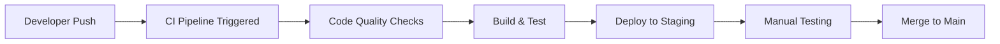
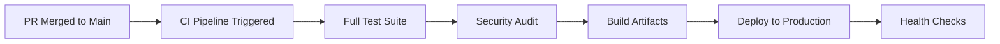

# EchoinWhispr CI/CD Pipeline

This document outlines the comprehensive CI/CD pipeline setup for the EchoinWhispr project, designed to ensure code quality, automated testing, and seamless deployment across all platforms.

## 📋 Overview

The CI/CD pipeline consists of multiple GitHub Actions workflows that handle:

- **Code Quality**: Automated linting, type checking, and formatting
- **Testing**: Unit tests and integration tests for all applications
- **Building**: Automated builds for Web, React Native, and Convex backend
- **Deployment**: Automated deployment to staging and production environments
- **Security**: Automated security audits and vulnerability scanning
- **Maintenance**: Automated dependency updates and cleanup

## 🏗️ Workflow Architecture

### Core Workflows

#### 1. `ci.yml` - Main CI Orchestration

- **Trigger**: Push/PR to main/develop branches
- **Purpose**: Coordinates all CI checks and provides overall status
- **Jobs**:
  - Root-level linting
  - Individual application CI workflows
  - Security audit
  - Deployment coordination

#### 2. `lint-and-quality.yml` - Shared Code Quality (Reusable)

- **Purpose**: Reusable workflow for linting and code quality checks
- **Features**:
  - TypeScript type checking
  - ESLint validation
  - Prettier formatting checks
  - Security vulnerability scanning

#### 3. `web-ci.yml` - Web Application CI/CD

- **Trigger**: Changes to `Web/` directory
- **Features**:
  - Next.js build and test
  - Vercel staging/production deployment
  - Build artifact management

#### 4. `react-native-ci.yml` - React Native CI/CD

- **Trigger**: Changes to `ReactNative/` directory
- **Features**:
  - Android APK and iOS archive builds
  - Expo staging/production publishing
  - Cross-platform build support

#### 5. `convex-ci.yml` - Convex Backend CI/CD

- **Trigger**: Changes to `Convex/` directory
- **Features**:
  - Schema validation and generation
  - Backend deployment to staging/production
  - Migration analysis

#### 6. `maintenance.yml` - Automated Maintenance

- **Trigger**: Weekly schedule + manual dispatch
- **Features**:
  - Dependency updates
  - Security audits
  - Code quality maintenance
  - Artifact cleanup

## 🔧 Setup Instructions

### 1. Repository Secrets Configuration

Configure the following secrets in your GitHub repository settings:

#### Vercel Deployment (Web App)

```bash
VERCEL_TOKEN=your_vercel_token
VERCEL_PROJECT_ID=your_project_id
VERCEL_ORG_ID=your_org_id
```

#### Expo Deployment (React Native)

```bash
EXPO_TOKEN=your_expo_token
EXPO_PUBLIC_CONVEX_URL=your_convex_url
EXPO_PUBLIC_CLERK_PUBLISHABLE_KEY=your_clerk_key
```

#### Convex Backend

```bash
CONVEX_STAGING_DEPLOY_KEY=staging_deploy_key
CONVEX_STAGING_DEPLOYMENT=staging_deployment_name
CONVEX_PRODUCTION_DEPLOY_KEY=production_deploy_key
CONVEX_PRODUCTION_DEPLOYMENT=production_deployment_name
```

#### Environment Variables for Builds

```bash
# Web App
NEXT_PUBLIC_CONVEX_URL=your_convex_url
NEXT_PUBLIC_CLERK_PUBLISHABLE_KEY=your_clerk_key
CLERK_SECRET_KEY=your_clerk_secret
CONVEX_DEPLOYMENT=your_deployment_name
```

### 2. Branch Protection Rules

Set up branch protection for `main` branch:

1. Go to Repository Settings → Branches
2. Add rule for `main` branch
3. Enable:
   - ✅ Require status checks to pass
   - ✅ Require branches to be up to date
   - ✅ Include administrators
4. Required status checks:
   - `ci-status`
   - `security-audit`

### 3. Environment Setup

#### Staging Environment

- **Web**: Vercel preview deployments
- **Mobile**: Expo staging channel
- **Backend**: Convex staging deployment

#### Production Environment

- **Web**: Vercel production deployment
- **Mobile**: Expo production channel
- **Backend**: Convex production deployment

## 🚀 Deployment Flow

### Development Workflow



### Production Deployment



## 📊 Monitoring and Alerts

### Workflow Status Badges

Add these badges to your README:

```markdown
[](https://github.com/your-username/echoinwhispr/actions/workflows/ci.yml)
[](https://github.com/your-username/echoinwhispr/actions/workflows/web-ci.yml)
[](https://github.com/your-username/echoinwhispr/actions/workflows/react-native-ci.yml)
[](https://github.com/your-username/echoinwhispr/actions/workflows/convex-ci.yml)
```

### Notification Setup

#### Slack Notifications

```yaml
# Add to any workflow
- name: Notify Slack
  uses: 8398a7/action-slack@v3
  if: always()
  with:
    status: ${{ job.status }}
    webhook_url: ${{ secrets.SLACK_WEBHOOK_URL }}
```

#### Discord Notifications

```yaml
- name: Notify Discord
  uses: sarisia/actions-status-discord@v1
  if: always()
  with:
    webhook: ${{ secrets.DISCORD_WEBHOOK }}
```

## 🛠️ Troubleshooting

### Common Issues

#### 1. Build Failures

- **Web App**: Check Next.js build logs, verify environment variables
- **React Native**: Ensure Expo CLI is properly configured, check Android/iOS build logs
- **Convex**: Verify schema syntax, check deployment keys

#### 2. Deployment Issues

- **Vercel**: Check project configuration, verify tokens
- **Expo**: Ensure app.json is valid, check Expo account permissions
- **Convex**: Verify deployment environment variables

#### 3. Workflow Timeouts

- Increase timeout in workflow settings
- Optimize build processes
- Use build caches effectively

### Debug Mode

To run workflows in debug mode:
1. Go to Actions tab
2. Select the workflow run
3. Click "Re-run jobs" with debug logging enabled

## 📈 Performance Optimization

### Caching Strategies

- **PNPM Store**: Cached across runs for faster installs
- **Build Artifacts**: Cached for incremental builds
- **Node Modules**: Cached per workflow and OS

### Parallel Execution

- Independent workflows run in parallel
- Jobs within workflows optimized for concurrency
- Build matrices for cross-platform testing

## 🔒 Security Considerations

### Secret Management

- All secrets stored in GitHub Secrets
- No hardcoded credentials in workflows
- Regular rotation of access tokens

### Access Control

- Branch protection rules enforced
- Required reviews for production deployments
- Automated security scanning

### Audit Trail

- Complete workflow execution logs
- Deployment history tracking
- Security scan reports archived

## 📚 Additional Resources

- [GitHub Actions Documentation](https://docs.github.com/en/actions)
- [Vercel Deployment Guide](https://vercel.com/docs/deployments/overview)
- [Expo Build Guide](https://docs.expo.dev/build/introduction/)
- [Convex Deployment](https://docs.convex.dev/production/hosting)
- [PNPM Documentation](https://pnpm.io/)

## 🤝 Contributing

When adding new workflows or modifying existing ones:

1. Follow the established naming conventions
2. Include comprehensive documentation
3. Add appropriate error handling
4. Test workflows thoroughly before merging
5. Update this documentation

---

**Last Updated**: August 2025
**Version**: 1.0.0
