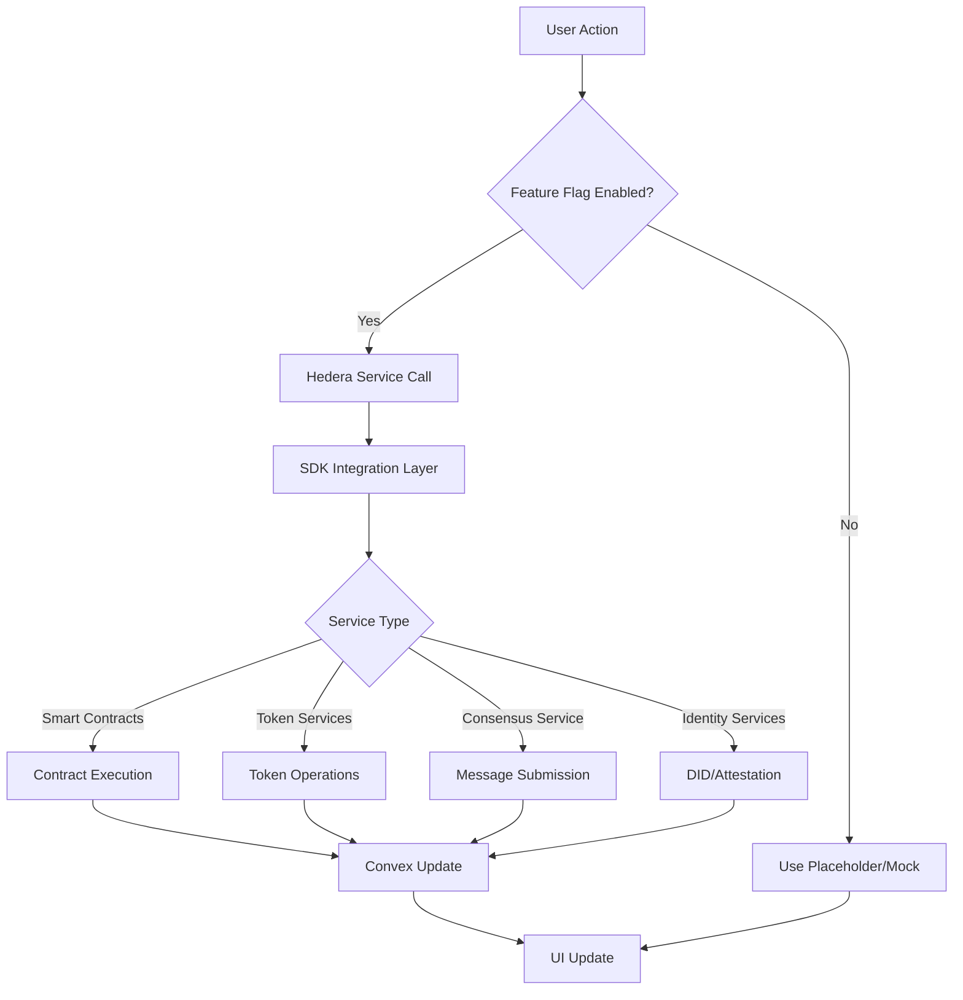
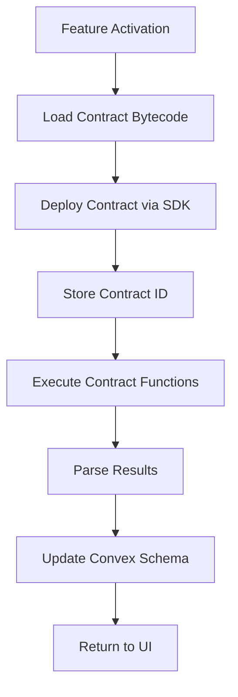
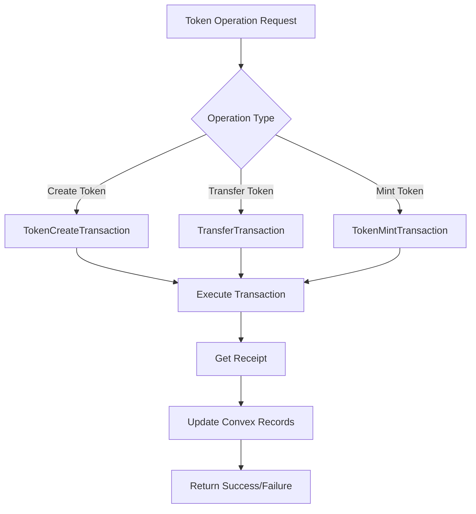
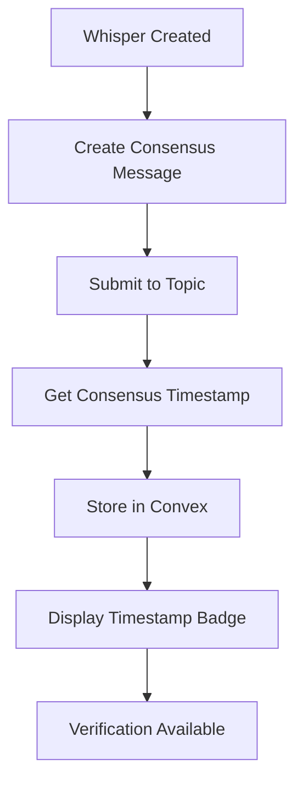
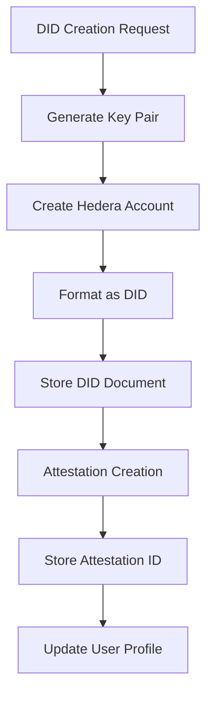

# Hedera Integration Guide for EchoinWhispr

This comprehensive guide provides step-by-step instructions for replacing placeholder hooks with actual Hedera service integrations when ready to activate deferred features. The guide focuses on the 10 implemented features and maintains the project's architectural patterns.

## Table of Contents

1. [Prerequisites](#prerequisites)
2. [Hedera Services Overview](#hedera-services-overview)
3. [Smart Contracts Service Integration](#smart-contracts-service-integration)
4. [Hedera Token Services (HTS) Integration](#hedera-token-services-hts-integration)
5. [Hedera Consensus Service (HCS) Integration](#hedera-consensus-service-hcs-integration)
6. [Hedera Identity Services Integration](#hedera-identity-services-integration)
7. [Testing Procedures](#testing-procedures)
8. [Deployment Considerations](#deployment-considerations)

## Prerequisites

### Environment Setup

1. **Hedera Account Setup**
   - Create Hedera testnet account at [portal.hedera.com](https://portal.hedera.com)
   - Fund account with test HBAR
   - Note account ID and private key for configuration

2. **SDK Installation**
   ```bash
   npm install @hashgraph/sdk
   # or
   yarn add @hashgraph/sdk
   ```

3. **Environment Variables**
   ```env
   HEDERA_NETWORK=testnet  # or mainnet
   HEDERA_ACCOUNT_ID=0.0.xxxxx
   HEDERA_PRIVATE_KEY=your_private_key
   HEDERA_PUBLIC_KEY=your_public_key
   ```

4. **Project Dependencies**
   - Ensure all placeholder hooks are implemented
   - Feature flags are properly configured
   - Convex schema extensions are in place

## Hedera Services Overview

### Services by Feature

| Feature | Hedera Service | Purpose |
|---------|---------------|---------|
| Interest-Based Anonymous Matching | Smart Contracts | Decentralized matching logic |
| Random Anonymous Messaging | Smart Contracts | Equitable distribution algorithms |
| Career-Focused Search Whispers | Smart Contracts | Verifiable career claims |
| Subscription Model | HTS | Token-based payments |
| Tokenized Rewards & Tipping | HTS | Custom token creation and transfers |
| Immutable Whisper Timestamping | HCS | Timestamping and verification |
| Persona Profiles Verification | Identity Services | Attestation and verification |
| Hedera-Based DID Verification | Identity Services | Decentralized identity management |
| Anonymous Community Governance | Smart Contracts | Voting mechanisms |

## Smart Contracts Service Integration

### Features Using Smart Contracts
- Interest-Based Anonymous Matching
- Random Anonymous Messaging
- Career-Focused User Search and Whispers
- Hedera-Powered Anonymous Community Governance

### Step-by-Step Integration

#### 1. Contract Development Setup

```typescript
// src/lib/hedera/smartContracts.ts
import {
  Client,
  ContractCreateTransaction,
  ContractExecuteTransaction,
  ContractFunctionParameters,
  Hbar,
  PrivateKey
} from '@hashgraph/sdk';

export class HederaSmartContracts {
  private client: Client;

  constructor(network: string, accountId: string, privateKey: string) {
    this.client = this.initializeClient(network, accountId, privateKey);
  }

  private initializeClient(network: string, accountId: string, privateKey: string): Client {
    const client = network === 'testnet' ? Client.forTestnet() : Client.forMainnet();
    client.setOperator(accountId, PrivateKey.fromString(privateKey));
    return client;
  }

  async deployContract(bytecode: string, constructorParams: any[] = []): Promise<string> {
    const transaction = new ContractCreateTransaction()
      .setBytecode(bytecode)
      .setGas(100000)
      .setConstructorParameters(
        new ContractFunctionParameters().addStringArray(constructorParams)
      );

    const txResponse = await transaction.execute(this.client);
    const receipt = await txResponse.getReceipt(this.client);

    return receipt.contractId?.toString() || '';
  }

  async executeContractFunction(
    contractId: string,
    functionName: string,
    params: any[] = [],
    gas: number = 30000
  ): Promise<any> {
    const transaction = new ContractExecuteTransaction()
      .setContractId(contractId)
      .setGas(gas)
      .setFunction(functionName, new ContractFunctionParameters().addStringArray(params));

    const txResponse = await transaction.execute(this.client);
    const record = await txResponse.getRecord(this.client);

    return record.contractFunctionResult;
  }
}
```

#### 2. Interest-Based Matching Contract Integration

Replace placeholder in `useInterestMatching.ts`:

```typescript
// Before (placeholder)
const deployMatchingContract = async (contractCode: string): Promise<string> => {
  console.log('Deploying matching contract:', contractCode);
  return 'mock-contract-id';
};

// After (actual integration)
const deployMatchingContract = async (contractCode: string): Promise<string> => {
  try {
    const contractsService = new HederaSmartContracts(
      process.env.HEDERA_NETWORK!,
      process.env.HEDERA_ACCOUNT_ID!,
      process.env.HEDERA_PRIVATE_KEY!
    );

    const contractId = await contractsService.deployContract(contractCode);
    return contractId;
  } catch (error) {
    console.error('Failed to deploy matching contract:', error);
    throw error;
  }
};
```

#### 3. Random Messaging Distribution Integration

Replace placeholder in `useRandomMessaging.ts`:

```typescript
// Before (placeholder)
const selectRandomRecipient = useCallback(async (): Promise<string | null> => {
  // Placeholder for Hedera equitable distribution logic
  return 'mock-recipient-id';
}, []);

// After (actual integration)
const selectRandomRecipient = useCallback(async (): Promise<string | null> => {
  try {
    const contractsService = new HederaSmartContracts(
      process.env.HEDERA_NETWORK!,
      process.env.HEDERA_ACCOUNT_ID!,
      process.env.HEDERA_PRIVATE_KEY!
    );

    // Call smart contract function for equitable random selection
    const result = await contractsService.executeContractFunction(
      process.env.RANDOM_DISTRIBUTION_CONTRACT_ID!,
      'selectRandomRecipient',
      [currentUserId]
    );

    return result.getString(0);
  } catch (error) {
    console.error('Failed to select random recipient:', error);
    return null;
  }
}, [currentUserId]);
```

## Hedera Token Services (HTS) Integration

### Features Using HTS
- Subscription Model for Enhanced Access
- Tokenized Whisper Rewards and Tipping

### Step-by-Step Integration

#### 1. Token Service Setup

```typescript
// src/lib/hedera/tokenServices.ts
import {
  Client,
  TokenCreateTransaction,
  TokenMintTransaction,
  TokenAssociateTransaction,
  TransferTransaction,
  Hbar,
  PrivateKey,
  TokenId
} from '@hashgraph/sdk';

export class HederaTokenServices {
  private client: Client;

  constructor(network: string, accountId: string, privateKey: string) {
    this.client = this.initializeClient(network, accountId, privateKey);
  }

  private initializeClient(network: string, accountId: string, privateKey: string): Client {
    const client = network === 'testnet' ? Client.forTestnet() : Client.forMainnet();
    client.setOperator(accountId, PrivateKey.fromString(privateKey));
    return client;
  }

  async createToken(
    name: string,
    symbol: string,
    initialSupply: number,
    decimals: number = 0
  ): Promise<string> {
    const transaction = new TokenCreateTransaction()
      .setTokenName(name)
      .setTokenSymbol(symbol)
      .setTreasuryAccountId(this.client.operatorAccountId!)
      .setInitialSupply(initialSupply)
      .setDecimals(decimals)
      .setMaxTransactionFee(new Hbar(30));

    const txResponse = await transaction.execute(this.client);
    const receipt = await txResponse.getReceipt(this.client);

    return receipt.tokenId?.toString() || '';
  }

  async transferTokens(
    tokenId: string,
    recipientId: string,
    amount: number
  ): Promise<void> {
    const transaction = new TransferTransaction()
      .addTokenTransfer(tokenId, this.client.operatorAccountId!, -amount)
      .addTokenTransfer(tokenId, recipientId, amount)
      .setMaxTransactionFee(new Hbar(30));

    await transaction.execute(this.client);
  }

  async mintTokens(tokenId: string, amount: number): Promise<void> {
    const transaction = new TokenMintTransaction()
      .setTokenId(tokenId)
      .setAmount(amount)
      .setMaxTransactionFee(new Hbar(30));

    await transaction.execute(this.client);
  }
}
```

#### 2. Subscription Payment Integration

Replace placeholder in `useSubscriptionManager.ts`:

```typescript
// Before (placeholder)
const processPayment = async (amount: number, tier: string) => {
  console.log(`Processing Hedera payment of ${amount} HBAR for tier: ${tier}`);
  // Placeholder: Process payment through Hedera
  return true;
};

// After (actual integration)
const processPayment = async (amount: number, tier: string) => {
  try {
    const tokenService = new HederaTokenServices(
      process.env.HEDERA_NETWORK!,
      process.env.HEDERA_ACCOUNT_ID!,
      process.env.HEDERA_PRIVATE_KEY!
    );

    // Transfer HBAR for subscription
    const transaction = new TransferTransaction()
      .addHbarTransfer(process.env.PLATFORM_ACCOUNT_ID!, new Hbar(amount))
      .addHbarTransfer(process.env.HEDERA_ACCOUNT_ID!, new Hbar(-amount));

    await transaction.execute(tokenService['client']);

    // Update user subscription in Convex
    await updateSubscriptionMutation({ userId: currentUserId, tier, amount });

    return true;
  } catch (error) {
    console.error('Payment processing failed:', error);
    return false;
  }
};
```

#### 3. Token Rewards Integration

Replace placeholder in `useTokenManager.ts`:

```typescript
// Before (placeholder)
const transferTokens = async (
  recipientId: string,
  amount: number,
  whisperId?: string
): Promise<void> => {
  console.log('Token transfer placeholder:', { recipientId, amount, whisperId });
  // TODO: Implement Hedera Token Services transfer logic
};

// After (actual integration)
const transferTokens = async (
  recipientId: string,
  amount: number,
  whisperId?: string
): Promise<void> => {
  try {
    const tokenService = new HederaTokenServices(
      process.env.HEDERA_NETWORK!,
      process.env.HEDERA_ACCOUNT_ID!,
      process.env.HEDERA_PRIVATE_KEY!
    );

    await tokenService.transferTokens(
      process.env.WHISPER_TOKEN_ID!,
      recipientId,
      amount
    );

    // Record transaction in Convex
    await recordTokenTransactionMutation({
      userId: currentUserId,
      recipientId,
      amount,
      type: 'transfer',
      whisperId
    });
  } catch (error) {
    console.error('Token transfer failed:', error);
    throw error;
  }
};
```

## Hedera Consensus Service (HCS) Integration

### Features Using HCS
- Immutable Whisper Timestamping via Consensus Service

### Step-by-Step Integration

#### 1. Consensus Service Setup

```typescript
// src/lib/hedera/consensusService.ts
import {
  Client,
  TopicCreateTransaction,
  TopicMessageSubmitTransaction,
  TopicMessageQuery,
  PrivateKey
} from '@hashgraph/sdk';

export class HederaConsensusService {
  private client: Client;

  constructor(network: string, accountId: string, privateKey: string) {
    this.client = this.initializeClient(network, accountId, privateKey);
  }

  private initializeClient(network: string, accountId: string, privateKey: string): Client {
    const client = network === 'testnet' ? Client.forTestnet() : Client.forMainnet();
    client.setOperator(accountId, PrivateKey.fromString(privateKey));
    return client;
  }

  async createTopic(memo: string = ''): Promise<string> {
    const transaction = new TopicCreateTransaction()
      .setTopicMemo(memo)
      .setMaxTransactionFee(new Hbar(30));

    const txResponse = await transaction.execute(this.client);
    const receipt = await txResponse.getReceipt(this.client);

    return receipt.topicId?.toString() || '';
  }

  async submitMessage(topicId: string, message: string): Promise<string> {
    const transaction = new TopicMessageSubmitTransaction()
      .setTopicId(topicId)
      .setMessage(message)
      .setMaxTransactionFee(new Hbar(30));

    const txResponse = await transaction.execute(this.client);
    const receipt = await txResponse.getReceipt(this.client);

    return receipt.topicSequenceNumber?.toString() || '';
  }

  async getMessage(topicId: string, sequenceNumber: string): Promise<any> {
    const query = new TopicMessageQuery()
      .setTopicId(topicId)
      .setStartTime(new Date(Date.now() - 86400000)) // Last 24 hours
      .setLimit(1);

    const messages = await query.execute(this.client);
    return messages[0];
  }
}
```

#### 2. Whisper Timestamping Integration

Replace placeholder in `useConsensusTimestamping.ts`:

```typescript
// Before (placeholder)
const submitWhisperToConsensus = async (params: SubmitToConsensusParams) => {
  console.log('Submitting whisper to consensus:', params);
  // This would call Hedera Consensus Service API
  return {
    success: true,
    timestamp: new Date().toISOString(),
    hash: 'mock-hash'
  };
};

// After (actual integration)
const submitWhisperToConsensus = async (params: SubmitToConsensusParams) => {
  try {
    const consensusService = new HederaConsensusService(
      process.env.HEDERA_NETWORK!,
      process.env.HEDERA_ACCOUNT_ID!,
      process.env.HEDERA_PRIVATE_KEY!
    );

    // Create message with whisper data
    const messageData = JSON.stringify({
      whisperId: params.whisperId,
      content: params.content,
      senderId: params.senderId,
      timestamp: new Date().toISOString()
    });

    // Submit to consensus topic
    const sequenceNumber = await consensusService.submitMessage(
      process.env.WHISPER_TOPIC_ID!,
      messageData
    );

    // Get the consensus timestamp
    const message = await consensusService.getMessage(
      process.env.WHISPER_TOPIC_ID!,
      sequenceNumber
    );

    // Update whisper in Convex with consensus data
    await updateWhisperConsensusMutation({
      whisperId: params.whisperId,
      consensusTimestamp: message.consensusTimestamp,
      consensusHash: message.hash,
      consensusTopicId: process.env.WHISPER_TOPIC_ID
    });

    return {
      success: true,
      timestamp: message.consensusTimestamp,
      hash: message.hash
    };
  } catch (error) {
    console.error('Consensus submission failed:', error);
    return {
      success: false,
      error: error.message
    };
  }
};
```

## Hedera Identity Services Integration

### Features Using Identity Services
- Persona Profiles with Verification
- Hedera-Based Decentralized Identity Verification

### Step-by-Step Integration

#### 1. Identity Services Setup

```typescript
// src/lib/hedera/identityServices.ts
import {
  Client,
  PrivateKey,
  PublicKey,
  KeyList,
  AccountCreateTransaction,
  AccountId
} from '@hashgraph/sdk';

export class HederaIdentityServices {
  private client: Client;

  constructor(network: string, accountId: string, privateKey: string) {
    this.client = this.initializeClient(network, accountId, privateKey);
  }

  private initializeClient(network: string, accountId: string, privateKey: string): Client {
    const client = network === 'testnet' ? Client.forTestnet() : Client.forMainnet();
    client.setOperator(accountId, PrivateKey.fromString(privateKey));
    return client;
  }

  async createDID(publicKey: string): Promise<string> {
    // Create a new account for the DID
    const key = PublicKey.fromString(publicKey);
    const transaction = new AccountCreateTransaction()
      .setKey(key)
      .setInitialBalance(new Hbar(1))
      .setMaxTransactionFee(new Hbar(30));

    const txResponse = await transaction.execute(this.client);
    const receipt = await txResponse.getReceipt(this.client);

    const accountId = receipt.accountId?.toString();
    return `did:hedera:${accountId}`;
  }

  async createAttestation(
    issuerId: string,
    subjectId: string,
    claims: Record<string, any>
  ): Promise<string> {
    // Create attestation data
    const attestationData = {
      issuer: issuerId,
      subject: subjectId,
      claims,
      issuedAt: new Date().toISOString(),
      expiresAt: new Date(Date.now() + 365 * 24 * 60 * 60 * 1000).toISOString() // 1 year
    };

    // In a real implementation, this would create a verifiable credential
    // For now, return a mock attestation ID
    const attestationId = `attestation_${Date.now()}_${Math.random().toString(36).substr(2, 9)}`;

    return attestationId;
  }

  async verifyAttestation(attestationId: string): Promise<boolean> {
    // Verify attestation exists and is valid
    // In a real implementation, this would check against Hedera network
    return attestationId.startsWith('attestation_');
  }
}
```

#### 2. Persona Attestation Integration

Replace placeholder in `usePersonaAttestation.ts`:

```typescript
// Before (placeholder)
const createAttestation = async (personaData: {
  career: string;
  skills: string[];
  expertise: string;
}): Promise<string> => {
  console.log('Creating attestation for persona:', personaData);
  return `attestation_${Date.now()}`;
};

// After (actual integration)
const createAttestation = async (personaData: {
  career: string;
  skills: string[];
  expertise: string;
}): Promise<string> => {
  try {
    const identityService = new HederaIdentityServices(
      process.env.HEDERA_NETWORK!,
      process.env.HEDERA_ACCOUNT_ID!,
      process.env.HEDERA_PRIVATE_KEY!
    );

    const attestationId = await identityService.createAttestation(
      process.env.PLATFORM_DID!,
      currentUserId,
      personaData
    );

    // Update user profile with attestation
    await updatePersonaAttestationMutation({
      userId: currentUserId,
      attestationId,
      ...personaData
    });

    return attestationId;
  } catch (error) {
    console.error('Attestation creation failed:', error);
    throw error;
  }
};
```

#### 3. DID Creation Integration

Replace placeholder in `useDecentralizedIdentity.ts`:

```typescript
// Before (placeholder)
const createDID = async (): Promise<string | null> => {
  try {
    console.log('DID creation not yet implemented - Hedera integration required');
    // Mock DID for foundation phase
    return `did:hedera:mock_${Date.now()}`;
  } catch (error) {
    console.error('DID creation failed:', error);
    return null;
  }
};

// After (actual integration)
const createDID = async (): Promise<string | null> => {
  try {
    const identityService = new HederaIdentityServices(
## Architecture Diagrams

### Overall Integration Flow



### Smart Contracts Integration Flow



### Token Services Integration Flow



### Consensus Service Integration Flow



### Identity Services Integration Flow



This guide provides a complete roadmap for integrating Hedera services into the EchoinWhispr platform while maintaining architectural consistency and following best practices for blockchain integration.
      process.env.HEDERA_NETWORK!,
      process.env.HEDERA_ACCOUNT_ID!,
      process.env.HEDERA_PRIVATE_KEY!
    );

    // Get user's public key (assuming it's stored in user profile)
    const userProfile = await getUserProfile(currentUserId);
    if (!userProfile?.publicKey) {
      throw new Error('User public key not found');
    }

    const did = await identityService.createDID(userProfile.publicKey);

    // Update user profile with DID
    await updateUserDIDMutation({
      userId: currentUserId,
      didId: did
    });

    return did;
  } catch (error) {
    console.error('DID creation failed:', error);
    return null;
  }
};
```

## Testing Procedures

### Unit Testing

```typescript
// src/__tests__/hedera-integration.test.ts
import { HederaSmartContracts } from '../lib/hedera/smartContracts';
import { HederaTokenServices } from '../lib/hedera/tokenServices';
import { HederaConsensusService } from '../lib/hedera/consensusService';
import { HederaIdentityServices } from '../lib/hedera/identityServices';

describe('Hedera Integration Tests', () => {
  const testAccountId = process.env.TEST_HEDERA_ACCOUNT_ID!;
  const testPrivateKey = process.env.TEST_HEDERA_PRIVATE_KEY!;

  describe('Smart Contracts Service', () => {
    it('should deploy a contract successfully', async () => {
      const contractsService = new HederaSmartContracts(
        'testnet',
        testAccountId,
        testPrivateKey
      );

      const bytecode = '608060405234801561001057600080fd5b50d3801561001d57600080fd5b50d2801561002a57600080fd5b5060c0806100386000396000f3fe6080604052600080fdfe'; // Simple contract bytecode
      const contractId = await contractsService.deployContract(bytecode);

      expect(contractId).toBeDefined();
      expect(contractId).toMatch(/^0\.0\.\d+$/);
    });
  });

  describe('Token Services', () => {
    it('should create a token successfully', async () => {
      const tokenService = new HederaTokenServices(
        'testnet',
        testAccountId,
        testPrivateKey
      );

      const tokenId = await tokenService.createToken(
        'TestToken',
        'TTK',
        1000000,
        2
      );

      expect(tokenId).toBeDefined();
      expect(tokenId).toMatch(/^0\.0\.\d+$/);
    });
  });

  describe('Consensus Service', () => {
    it('should submit a message to consensus topic', async () => {
      const consensusService = new HederaConsensusService(
        'testnet',
        testAccountId,
        testPrivateKey
      );

      const topicId = await consensusService.createTopic('Test Topic');
      const sequenceNumber = await consensusService.submitMessage(
        topicId,
        'Test message'
      );

      expect(sequenceNumber).toBeDefined();
      expect(parseInt(sequenceNumber)).toBeGreaterThan(0);
    });
  });

  describe('Identity Services', () => {
    it('should create a DID successfully', async () => {
      const identityService = new HederaIdentityServices(
        'testnet',
        testAccountId,
        testPrivateKey
      );

      const publicKey = '302a300506032b6570032100114e6abc371b82dab5c15ea149f02d34a012087b163516dd70f44acafabf777fd'; // Example public key
      const did = await identityService.createDID(publicKey);

      expect(did).toBeDefined();
      expect(did).toMatch(/^did:hedera:0\.0\.\d+$/);
    });
  });
});
```

### Integration Testing

```typescript
// src/__tests__/feature-integration.test.ts
describe('Feature Integration Tests', () => {
  describe('Interest-Based Matching', () => {
    it('should deploy and execute matching contract', async () => {
      // Test full matching flow from hook to contract execution
      const { deployMatchingContract, queryMatches } = useInterestMatching();

      const contractId = await deployMatchingContract(matchingContractCode);
      expect(contractId).toBeDefined();

      const matches = await queryMatches(['javascript', 'react'], contractId);
      expect(Array.isArray(matches)).toBe(true);
    });
  });

  describe('Token Rewards', () => {
    it('should transfer tokens for whisper tipping', async () => {
      const { transferTokens, getTokenBalance } = useTokenManager();

      const initialBalance = await getTokenBalance(recipientId);
      await transferTokens(recipientId, 10, whisperId);

      const finalBalance = await getTokenBalance(recipientId);
      expect(finalBalance).toBe(initialBalance + 10);
    });
  });

  describe('Consensus Timestamping', () => {
    it('should timestamp whisper and verify immutability', async () => {
      const { submitWhisperToConsensus, verifyWhisperConsensus } = useConsensusTimestamping();

      const result = await submitWhisperToConsensus({
        whisperId,
        content: 'Test whisper',
        senderId
      });

      expect(result.success).toBe(true);
      expect(result.timestamp).toBeDefined();

      const verification = await verifyWhisperConsensus({
        whisperId,
        expectedTimestamp: result.timestamp
      });

      expect(verification.valid).toBe(true);
    });
  });
});
```

### End-to-End Testing Checklist

- [ ] Smart contract deployment and execution
- [ ] Token creation, minting, and transfers
- [ ] Consensus topic creation and message submission
- [ ] DID creation and attestation
- [ ] Feature flag activation and UI updates
- [ ] Error handling and fallback mechanisms
- [ ] Performance under load
- [ ] Gas fee optimization
- [ ] Network switching (testnet to mainnet)

## Deployment Considerations

### Environment Configuration

```typescript
// src/config/hedera.ts
export const hederaConfig = {
  network: process.env.NODE_ENV === 'production' ? 'mainnet' : 'testnet',
  operator: {
    accountId: process.env.HEDERA_ACCOUNT_ID!,
    privateKey: process.env.HEDERA_PRIVATE_KEY!,
    publicKey: process.env.HEDERA_PUBLIC_KEY!
  },
  contracts: {
    matching: process.env.MATCHING_CONTRACT_ID!,
    randomDistribution: process.env.RANDOM_DISTRIBUTION_CONTRACT_ID!,
    governance: process.env.GOVERNANCE_CONTRACT_ID!
  },
  tokens: {
    whisperToken: process.env.WHISPER_TOKEN_ID!,
    subscriptionToken: process.env.SUBSCRIPTION_TOKEN_ID!
  },
  topics: {
    whispers: process.env.WHISPER_TOPIC_ID!,
    governance: process.env.GOVERNANCE_TOPIC_ID!
  }
};
```

### Security Best Practices

1. **Private Key Management**
   - Never store private keys in code
   - Use environment variables or secure key management services
   - Implement key rotation policies

2. **Transaction Signing**
   - Sign transactions client-side when possible
   - Use secure signing mechanisms
   - Implement transaction validation

3. **Error Handling**
   - Implement comprehensive error handling
   - Provide user-friendly error messages
   - Log errors securely without exposing sensitive data

4. **Rate Limiting**
   - Implement rate limiting for Hedera operations
   - Monitor gas costs and transaction fees
   - Set reasonable limits to prevent abuse

### Monitoring and Maintenance

```typescript
// src/lib/hedera/monitoring.ts
export class HederaMonitoring {
  async monitorTransactionStatus(transactionId: string): Promise<any> {
    // Implement transaction monitoring
  }

  async getNetworkStatus(): Promise<any> {
    // Monitor network health
  }

  async trackGasUsage(): Promise<any> {
    // Monitor gas consumption
  }
}
```

This guide provides a complete roadmap for integrating Hedera services into the EchoinWhispr platform while maintaining architectural consistency and following best practices for blockchain integration.